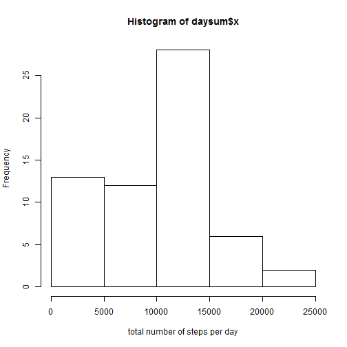
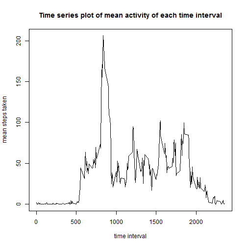
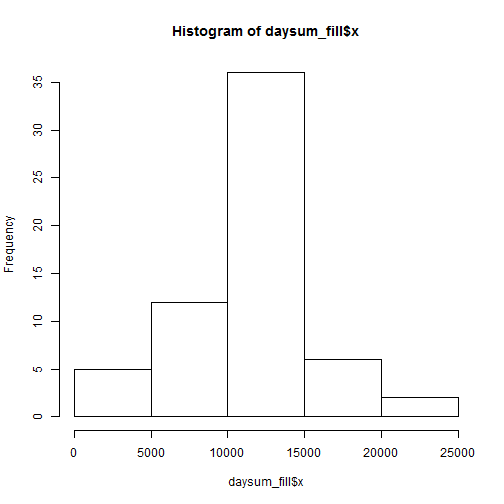

## Loading and preprocessing the data
1. As the original data is given in *.csv* format compressed into *.zip* format,
the very first step is to **unzip and read** the data file:

```r
activity <- read.csv(unz("activity.zip", "activity.csv"))
```

2. In order to better utilize information in the data frame, the *date* column
will be converted from *factor* to *POSIXct* date format:

```r
library(lubridate)
activity$Date <- ymd(activity$date)
```


## What is mean total number of steps taken per day?
1. Create a daily sum table and histogram with the following code:

```r
daysum <- with(activity,
               aggregate(steps, by = list(Date=Date), FUN = sum, na.rm = TRUE))
hist(daysum$x, xlab = "total number of steps per day")
```

 

2. It is then simply to find mean and median of the daily sums:

```r
mean(daysum$x)
```

```
## [1] 9354.23
```

```r
median(daysum$x)
```

```
## [1] 10395
```


## What is the average daily activity pattern?
To find daily activity pattern, it is to aggregate mean number of steps taken
across each interval:

```r
daypattern <- with(activity, 
                   aggregate(steps, by = list(interval=interval), FUN = mean,
                             na.rm = TRUE))
```

1. Time series plot of mean activity vs. time interval:

```r
plot(daypattern$interval, daypattern$x, type = "l",
     main = "Time series plot of mean activity of each time interval",
     xlab = "time interval", ylab = "mean steps taken")
```

 

2. Find the maximum value of *daypattern*:

```r
max(daypattern$x)
```

```
## [1] 206.1698
```


## Imputing missing values
1. Total number of rows with NA value in the original data frame:

```r
sum(is.na(activity$steps))
```

```
## [1] 2304
```

2. Fill in all the NA's with mean of the 5-min interval (i.e. daily pattern),
first find the interval index in the daily pattern of each NA value:

```r
na_index <- which(is.na(activity$steps))
pattern_index <- match(activity[na_index, "interval"], daypattern$interval)
```

3. Fill in NA's into a new column *steps_fill*:

```r
activity_fill <- activity
activity_fill[na_index, "steps"] <- daypattern[pattern_index, "x"]
```

4. Again, plot histogram of total number of steps taken per day, and find mean
and median:

```r
daysum_fill <- with(activity_fill, 
                    aggregate(steps, by = list(Date=Date), FUN = sum))
hist(daysum_fill$x)
```

 

```r
mean(daysum_fill$x)
```

```
## [1] 10766.19
```

```r
median(daysum_fill$x)
```

```
## [1] 10766.19
```
The new histogram looks more normally distributed from the shape of the figure. The mean is now brought up to the level **equal to median**.


## Are there differences in activity patterns between weekdays and weekends?
1. Add a factor variable to indicate weekday or weekend:

```r
activity_fill <- transform(activity_fill,
                           day = factor(ifelse(weekdays(Date) == "Saturday" |
                                            weekdays(Date) == "Sunday",
                                        "weekend", "weekday")))
```

2. Aggregate daily activity pattern across time intervals and weekday/weekend, and create the time series panel plots:

```r
library(lattice)
daypattern_fill <- with(activity_fill, 
                        aggregate(steps, by = list(interval=interval, day=day),
                                  FUN = mean))
xyplot(x ~ interval | day, type = "l", data = daypattern_fill,
       layout = c(1, 2), xlab = "Interval", ylab = "Number of steps")
```

 

